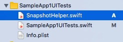
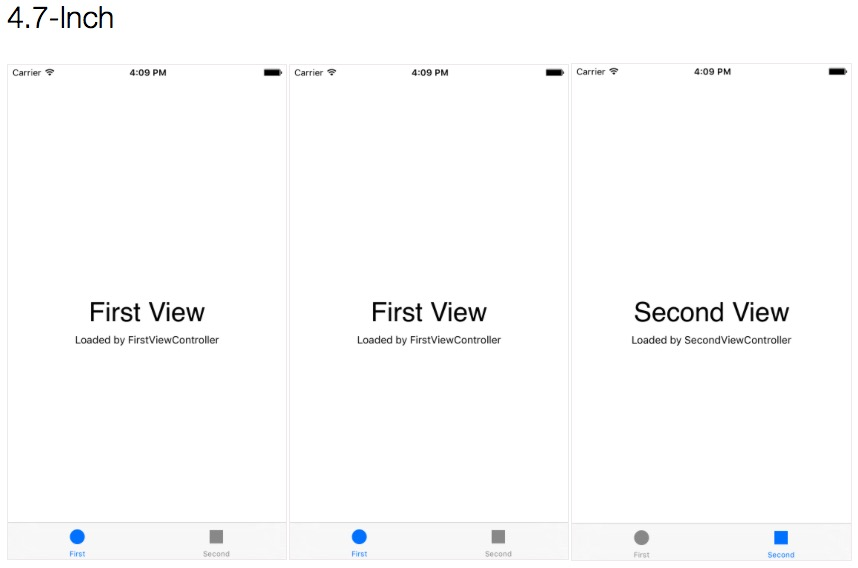
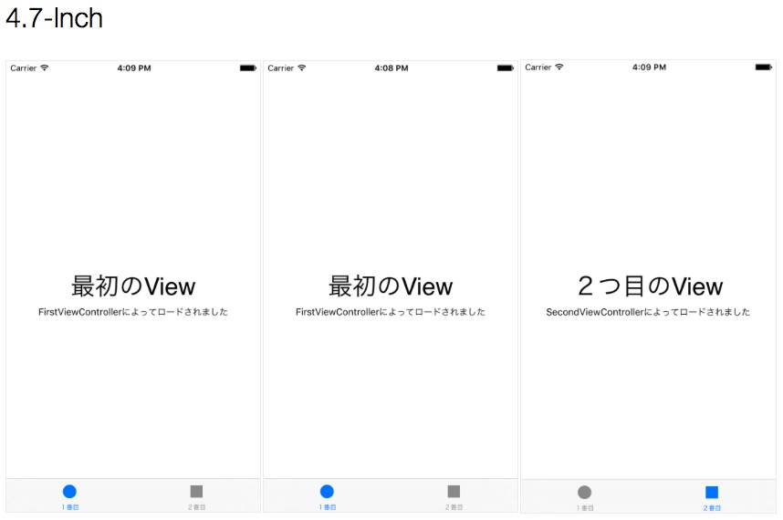
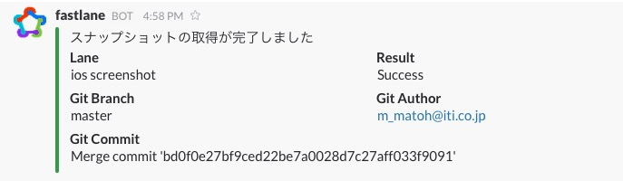
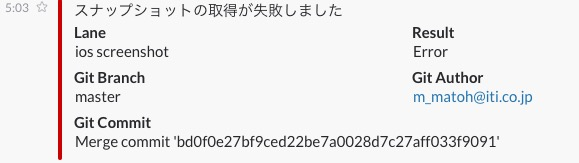

fastlane_memo
===============

fastlaneについてのやれやこれやをメモ


# 導入実験

## Xcodeで新規プロジェクト生成

手順を確認するためのサンプルアプリプロジェクトを用意しました。

## gitignoreを用意

fastlaneとはあまり関係ないですが、gitignoreを以下から取得しました。

https://github.com/github/gitignore/blob/master/Swift.gitignore

## fastlaneをbundlerでインストール

プロジェクトディレクトリに移動して、Gemfileを用意し、

    source "https://rubygems.org"
    gem 'fastlane'

bundlerでfastlaneをインストール。  
（rbenv-binstubsを導入している前提）

    bundle install --path=vendor/bundle --binstubs=vendor/bin

これで、`bundle exec`なしでfastlaneを実行できます。

## セットアップ

fastlaneのセットアップは以下のinitコマンドで行います。
あれこれと問われるので、ログを貼っておきます。
このあたりは今後内容がころころ変わってくる部分かもしれません。

    $ fastlane init
    [15:26:41]: Detected iOS/Mac project in current directory...
    [15:26:41]: This setup will help you get up and running in no time.
    [15:26:41]: fastlane will check what tools you're already using and set up
    [15:26:41]: the tool automatically for you. Have fun!
    [15:26:41]: Created new folder './fastlane'.
    Your Apple ID (e.g. fastlane@krausefx.com):
    [15:26:44]: Verifying if app is available on the Apple Developer Portal and iTunes Connect...
    [15:26:44]: Starting login with user ''
    -------------------------------------------------------------------------------------
    The login information you enter will be stored in your Mac OS Keychain
    You can also pass the password using the `FASTLANE_PASSWORD` env variable
    More information about it on GitHub: https://github.com/fastlane/fastlane/tree/master/credentials_manager
    -------------------------------------------------------------------------------------
    Username: matoh
    -------------------------------------------------------------------------------------
    The login information you enter will be stored in your Mac OS Keychain
    You can also pass the password using the `FASTLANE_PASSWORD` env variable
    More information about it on GitHub: https://github.com/fastlane/fastlane/tree/master/credentials_manager
    -------------------------------------------------------------------------------------
    Password (for matoh): ********
    [15:34:37]: No login data provided
    [15:34:37]: An error occured during the setup process. Falling back to manual setup!
    App Identifier (com.krausefx.app): jp.co.iti.SampleApp1
    [15:35:13]: Created new file './fastlane/Appfile'. Edit it to manage your preferred app metadata information.
    Would you like to create your app on iTunes Connect and the Developer Portal? (y/n)
    n
    Optional: The scheme name of your app (If you don't need one, just hit Enter):
    [15:39:11]: 'snapshot' not enabled.
    [15:39:11]: 'cocoapods' not enabled.
    [15:39:11]: 'carthage' not enabled.
    [15:39:11]: Created new file './fastlane/Fastfile'. Edit it to manage your own deployment lanes.
    [15:39:11]: fastlane will send the number of errors for each action to
    [15:39:11]: https://github.com/fastlane/enhancer to detect integration issues
    [15:39:11]: No sensitive/private information will be uploaded

AppStoreへのデプロイなどを行う想定ではないので、Apple IDは未入力にしました。
その後、`Username:`とプロンプトが出ますが、これに何を入れるべきかよくわかりませんでした。
入力しないと何度でもプロンプトが出てしまうので、入力する必要があります。
さらに、パスワードの入力を求められるので、何かしらを入力します。
エラーが起きたと表示されましたが、

    No login data provided
    An error occured during the setup process.

ひとまずこれは無視します。

fastlaneディレクトリが作成され、ファイルが２つ生成されます。

    $ ls -l fastlane
    total 16
    drwxr-xr-x   4 matoh  staff   136  4 28 15:39 ./
    drwxr-xr-x  14 matoh  staff   476  4 28 15:26 ../
    -rw-r--r--   1 matoh  staff   355  4 28 15:35 Appfile
    -rw-r--r--   1 matoh  staff  2099  4 28 15:39 Fastfile

## テスト実行

サンプルアプリは生成して何も手を加えていない状態ですが、XcodeによってXCTestのクラスも自動生成されています。
実質中身は空ですが、このテストを実行してみます。
Fastfile中に以下のコードがありますが、ここがテスト実行用のlaneになります。

```ruby
desc "Runs all the tests"
lane :test do
  scan
end
```

`scan`というのがActionと呼ばれるもので、テストの実行を行ってくれます。
利用できるActionは、以下のコマンドで確認できます。使えるActionはどんどん増えている模様です。

    $ fastlane actions

とにかく初期セットアップ状態で、テスト実行できる状態になっています。

    $ fastlane test

途中の出力で、

```
+-----------------------+------------------------+
|             Summary for scan 0.5.2             |
+-----------------------+------------------------+
| project               | ./SampleApp1.xcodeproj |
| scheme                | SampleApp1             |
| clean                 | false                  |
| code_coverage         | false                  |
| skip_build            | false                  |
| output_directory      | ./fastlane/test_output |
| output_types          | html,junit             |
| buildlog_path         | ~/Library/Logs/scan    |
| open_report           | false                  |
| skip_slack            | false                  |
| slack_only_on_failure | false                  |
+-----------------------+------------------------+
```

と出力されますが、これらはscanに指定できるパラメータ（の一部）のようです。

## テスト結果のSlack連携

テスト結果をSlackに連携できるようにしてみます。  
Slack側でIncoming WebHooksを登録し、


generalチャンネルにポストされるようにします。


そのURLを以下のようにFastfile中に設定します。

```ruby
before_all do
  ENV["SLACK_URL"] = "https://hooks.slack.com/services/T14E25J2U/B14ECFFRD/XXXXXXXXXXXXXXXXXXXXXX"
end
```

このようにしてから、先ほどと同様にテストを実行すると、実行結果がSlackに通知されるようになります。


## スナップショットの取得

もう１つアクションを試してみます。  
snapshotは、その名の通りアプリのスナップショット取得をサポートしてくれるアクションです。  
まず、以下のようにinitコマンドを実行して、必要なファイルを自動生成します。

    $ snapshot init
    Successfully created SnapshotHelper.swift './fastlane/SnapshotHelper.swift'
    Successfully created new Snapfile at './fastlane/Snapfile'
    -------------------------------------------------------
    Open your Xcode project and make sure to do the following:
    1) Add the ./fastlane/SnapshotHelper.swift to your UI Test target
       You can move the file anywhere you want
    2) Call `setupSnapshot(app)` when launching your app

      let app = XCUIApplication()
      setupSnapshot(app)
      app.launch()

    3) Add `snapshot("0Launch")` to wherever you want to create the screenshots

    More information on GitHub: https://github.com/fastlane/fastlane/tree/master/snapshot

ガイドにも書かれている通り、

- SnapshotHelper.swift
- Snapfile

の２ファイルが生成されます。

SnapshotHelper.swiftは、UI Testのターゲットに追加して利用します。



スナップショットを取得するために、以下のようにUI Testを書き換えます。  
（サンプルアプリはTabbed Applicationの雛形で生成したものです。）

```swift
class SampleApp1UITests: XCTestCase {

    override func setUp() {
        super.setUp()
        continueAfterFailure = false
        let app = XCUIApplication()
        setupSnapshot(app)
        app.launch()
    }

    override func tearDown() {
        super.tearDown()
    }

    func testExample() {
        snapshot("Launch")

        let tabBarsQuery = XCUIApplication().tabBars

        tabBarsQuery.buttons["Second"].tap()
        snapshot("Second")

        tabBarsQuery.buttons["First"].tap()
        snapshot("First")
    }

}
```

setupメソッド内でsetupSnapshot関数（SnapshotHelper.swiftに定義されている）を呼び出し、スナップショットを取得したい箇所でsnapshot関数を呼ぶようにします。

```
 (Tips) UI Test用に操作を記録する
Xcodeには画面操作をUI Testのスクリプトに変換する機能が備わっています。  
上の例の場合、testExampleメソッドにカーソルを置いた状態で、[Editor]-[Start Recoding UI Test]を選択します。
すると、シミュレータ上でアプリが起動し、それを操作すると、その結果がtestExampleメソッドに追記されます。
```

Snapfileには、テスト対象とするデバイスや言語を設定します。
自動生成された状態だとテスト対象の組み合わせが多すぎてしまうので、以下のように書き換えておきます。

```ruby
devices([
  "iPhone 6s",
  "iPhone 6s Plus",
])

languages([
  "ja-JP"
])
```

ここまでで一度テストを実施してみます。

    $ snapshot run

結果、スナップショットのファイルが以下のように生成されるはずです。

    $ ls -lR fastlane/screenshots
    total 24
    drwxr-xr-x   4 matoh  staff   136  5  6 14:44 ./
    drwxr-xr-x  10 matoh  staff   340  5  6 12:57 ../
    drwxr-xr-x   8 matoh  staff   272  5  6 13:07 ja-JP/
    -rw-r--r--   1 matoh  staff  8508  5  6 14:46 screenshots.html

    fastlane/screenshots/ja-JP:
    total 984
    drwxr-xr-x  8 matoh  staff     272  5  6 13:07 ./
    drwxr-xr-x  4 matoh  staff     136  5  6 14:44 ../
    -rw-r--r--  1 matoh  staff   55453  5  6 14:45 iPhone6s-First.png
    -rw-r--r--  1 matoh  staff   55453  5  6 14:45 iPhone6s-Launch.png
    -rw-r--r--  1 matoh  staff   54506  5  6 14:45 iPhone6s-Second.png
    -rw-r--r--  1 matoh  staff  110583  5  6 14:46 iPhone6sPlus-First.png
    -rw-r--r--  1 matoh  staff  110583  5  6 14:46 iPhone6sPlus-Launch.png
    -rw-r--r--  1 matoh  staff  110245  5  6 14:46 iPhone6sPlus-Second.png

screenshots.htmlでは、取得したスナップショットを一覧参照できるようになっています。

### 多言語対応してみる

せっかく言語を切り替えながらのスナップショットを取得できるので、その機能を試してみます。  
まず、サンプルアプリを多言語対応を施します。
言語に日本語が選択されたら、日本語が画面表示されるように対応します。  
次に、UI Testのスクリプトを対応します。
上のスクリプトでは、タブバーのボタンを、そのキャプションで選択していますが、多言語対応してしまうとそうもいかなくなります。
UI Testで対象の要素を取得する手段の一つに`accessibility identifier`を設定する方法があるのですが、タブバーでは利用できないようです。
そこで、以下のように「何番目」を指定するように書き換えます。

```swift
tabBarsQuery.buttons.elementBoundByIndex(1).tap()
snapshot("Second")

tabBarsQuery.buttons.elementBoundByIndex(0).tap()
snapshot("First")
```

最後に、Snapfileを編集し、複数言語設定でのテストが実施されるようにします。

```ruby
languages([
  "ja-JP",
  "en-US"
])
```

このようにして再度実行すると、以下のように言語ごとのスナップショットが取得されていることを確認できます。
（screenshots.htmlの表示を抜粋しています）  

英語設定でのスナップショット



日本語設定でのスナップショット



### Slack連携してみる

scanとは異なり、snapshotはSlack連携のオプションは現時点では用意されていないようです。
Fastfileにlaneを追加して、Slack連携するようにしてみます。

```ruby
desc "Runs UI tests"
lane :screenshot do
  snapshot
end
```

さらに、処理が完了後、Slckに連携するよう、以下のようにします。
（laneが:testの場合は、ここでSlack連携を実行する必要はないので、if文で加えてあります）

```ruby
after_all do |lane|
  slack(message: "スナップショットの取得が完了しました") if lane == :screenshot
end

error do |lane, exception|
  slack(message: "スナップショットの取得が失敗しました", success: false) if lane == :screenshot
end
```

slackというアクションがあるので、それを利用しています。
利用方法は、actionsコマンドで確認することができます。

    $ fastlane actions slack

用意したlaneを実行します。

    $ fastlane screenshot

処理が成功すれば、以下のようにSlackに通知されます。



処理が失敗すると、以下のようにSlackに通知されます。


