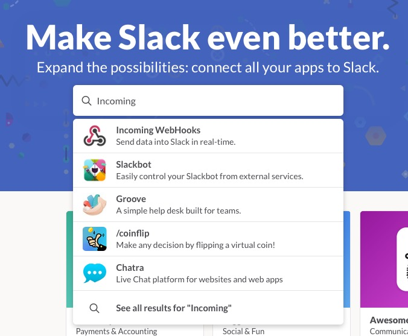
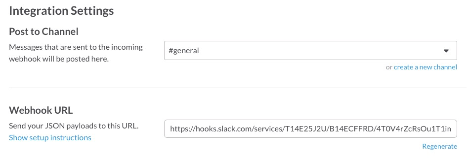

fastlane_memo
===============

fastlaneについてのやれやこれやをメモ


# 導入実験

## Xcodeで新規プロジェクト生成

手順を確認するためのサンプルアプリプロジェクトを用意しました。

## gitignoreを用意

fastlaneとはあまり関係ないですが、gitignoreを以下から取得しました。

https://github.com/github/gitignore/blob/master/Swift.gitignore

## fastlaneをbundlerでインストール

プロジェクトディレクトリに移動して、Gemfileを用意し、

    source "https://rubygems.org"
    gem 'fastlane'

bundlerでfastlaneをインストール。  
（rbenv-binstubsを導入している前提）

    bundle install --path=vendor/bundle --binstubs=vendor/bin

これで、`bundle exec`なしでfastlaneを実行できます。

## セットアップ

fastlaneのセットアップは以下のinitコマンドで行います。
あれこれと問われるので、ログを貼っておきます。
このあたりは今後内容がころころ変わってくる部分かもしれません。

    $ fastlane init
    /Users/matoh/OLT/gitbucket/SampleApp1/vendor/bundle/ruby/2.3.0/gems/commander-4.3.5/lib/commander/user_interaction.rb:334: warning: constant ::TimeoutError is deprecated
    [15:26:41]: Detected iOS/Mac project in current directory...
    [15:26:41]: This setup will help you get up and running in no time.
    [15:26:41]: fastlane will check what tools you're already using and set up
    [15:26:41]: the tool automatically for you. Have fun!
    [15:26:41]: Created new folder './fastlane'.
    Your Apple ID (e.g. fastlane@krausefx.com):
    [15:26:44]: Verifying if app is available on the Apple Developer Portal and iTunes Connect...
    [15:26:44]: Starting login with user ''
    -------------------------------------------------------------------------------------
    The login information you enter will be stored in your Mac OS Keychain
    You can also pass the password using the `FASTLANE_PASSWORD` env variable
    More information about it on GitHub: https://github.com/fastlane/fastlane/tree/master/credentials_manager
    -------------------------------------------------------------------------------------
    Username: matoh
    -------------------------------------------------------------------------------------
    The login information you enter will be stored in your Mac OS Keychain
    You can also pass the password using the `FASTLANE_PASSWORD` env variable
    More information about it on GitHub: https://github.com/fastlane/fastlane/tree/master/credentials_manager
    -------------------------------------------------------------------------------------
    Password (for matoh): ********
    [15:34:37]: No login data provided
    [15:34:37]: An error occured during the setup process. Falling back to manual setup!
    App Identifier (com.krausefx.app): jp.co.iti.SampleApp1
    [15:35:13]: Created new file './fastlane/Appfile'. Edit it to manage your preferred app metadata information.
    Would you like to create your app on iTunes Connect and the Developer Portal? (y/n)
    n
    Optional: The scheme name of your app (If you don't need one, just hit Enter):
    [15:39:11]: 'snapshot' not enabled.
    [15:39:11]: 'cocoapods' not enabled.
    [15:39:11]: 'carthage' not enabled.
    [15:39:11]: Created new file './fastlane/Fastfile'. Edit it to manage your own deployment lanes.
    [15:39:11]: fastlane will send the number of errors for each action to
    [15:39:11]: https://github.com/fastlane/enhancer to detect integration issues
    [15:39:11]: No sensitive/private information will be uploaded

AppStoreへのデプロイなどを行う想定ではないので、Apple IDは未入力にしました。
その後、`Username:`とプロンプトが出ますが、これに何を入れるべきかよくわかりませんでした。
入力しないと何度でもプロンプトが出てしまうので、入力する必要があります。
さらに、パスワードの入力を求められるので、何かしらを入力します。
エラーが起きたと表示されましたが、

    No login data provided
    An error occured during the setup process.

ひとまずこれは無視します。

fastlaneディレクトリが作成され、ファイルが２つ生成されます。

    $ ls -l fastlane
    total 16
    drwxr-xr-x   4 matoh  staff   136  4 28 15:39 ./
    drwxr-xr-x  14 matoh  staff   476  4 28 15:26 ../
    -rw-r--r--   1 matoh  staff   355  4 28 15:35 Appfile
    -rw-r--r--   1 matoh  staff  2099  4 28 15:39 Fastfile

## テスト実行

サンプルアプリは生成して何も手を加えていない状態ですが、XcodeによってXCTestのクラスも自動生成されています。
実質中身は空ですが、このテストを実行してみます。
Fastfile中に以下のコードがありますが、ここがテスト実行用のlaneになります。

```ruby
desc "Runs all the tests"
lane :test do
  scan
end
```

`scan`というのがActionと呼ばれるもので、テストの実行を行ってくれます。
利用できるActionは、以下のコマンドで確認できます。使えるActionはどんどん増えている模様です。

    $ fastlane actions

とにかく初期セットアップ状態で、テスト実行できる状態になっています。

    $ fastlane test

途中の出力で、

```
+-----------------------+------------------------+
|             Summary for scan 0.5.2             |
+-----------------------+------------------------+
| project               | ./SampleApp1.xcodeproj |
| scheme                | SampleApp1             |
| clean                 | false                  |
| code_coverage         | false                  |
| skip_build            | false                  |
| output_directory      | ./fastlane/test_output |
| output_types          | html,junit             |
| buildlog_path         | ~/Library/Logs/scan    |
| open_report           | false                  |
| skip_slack            | false                  |
| slack_only_on_failure | false                  |
+-----------------------+------------------------+
```

と出力されますが、これらはscanに指定できるパラメータのようです。

## テスト結果のSlack連携

テスト結果をSlackに連携できるようにしてみます。  
Slack側でIncoming WebHooksを登録し、



generalチャンネルにポストされるようにします。



そのURLを以下のようにFastfile中に設定します。

```ruby
before_all do
  ENV["SLACK_URL"] = "https://hooks.slack.com/services/T14E25J2U/B14ECFFRD/XXXXXXXXXXXXXXXXXXXXXX"
end
```

このようにしてから、先ほどと同様にテストを実行すると、実行結果がSlackに通知されるようになります。


